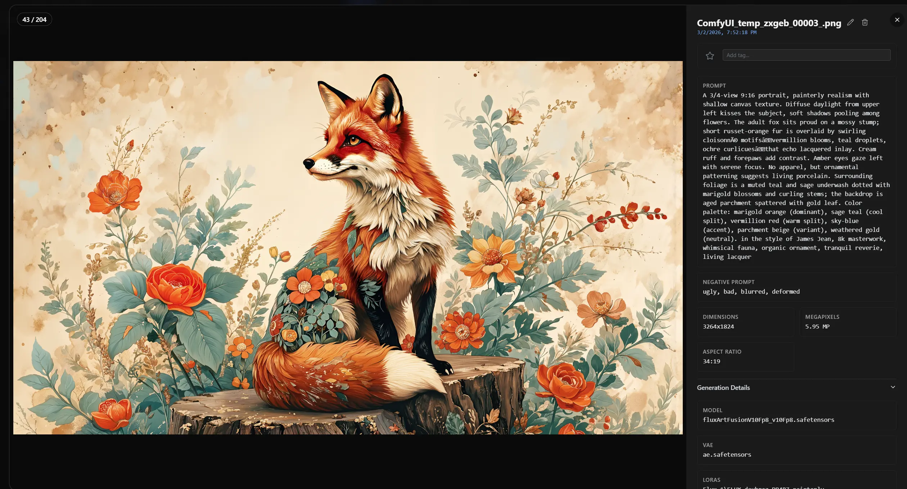

# SilkStack Image Browser

> _A powerful Image Browser for AI-generated images with ComfyUI metadata support, and more._

**SilkStack Image Browser** is a **local image browser and manager** focused on viewing AI-generated images.
It scans your folders, parses metadata from popular tools (ComfyUI, Automatic1111) and lets you search, filter and organize your images by prompt, model, and more - all offline, on your machine.


> This repo is a fork of **"Image MetaHub v0.13.0"**.

---

## Key features (overview)

- **Fast local browser** for AI images (no accounts, no cloud, no telemetry)
- **Rich metadata parsing** for Stable Diffusion / A1111 / ComfyUI and other tools, including WebP format.
- **Beautuful Image Grid** with adaptive layout and smooth scrolling.
- **Auto-Watch functionality** for real-time monitoring of output folders during generation.
- **Powerful search & filters** by prompt text, model, steps, CFG, sampler, seed, etc.
- **Smart Library** with clustering stacks and collections
- **Auto-tags and manual tags** for faster organization and discovery
- **Drag & Drop to ComfyUI** - Drag and drop images to ComfyUI to automatically load the prompt and workflow.

I have added a lot of new features to this project, notably:

- **An adaptive Image Grid** that automatically adjusts images based on the aspect ratio of the images and reduces white spaces.
- **Collapsible UI** that focuses on providing the best user experience for viewing images.
- **New Window layout** that is more compact and easier to navigate.
- **Easier Themes** - Removed the need to apply themes manually. The app will now automatically apply the system theme (Light/Dark).
- **Navigation improvements** - Added folders to the sidebar for easier navigation. You can also add emoji icons to folders 😉.
- **Support for Removable Drives** - You can add folders from removable drives (USB drives, SD cards, mount encrypted drives etc.) to the sidebar and the app will automatically restore the folders when the drive is reconnected.
- **& A lot of usability improvements** - Just try it out 😉.

Also a few features from the original project are removed or were not focused on (premium features of the original project), notably:

- Image Generation using ComfyUI or Automatic1111.
- Image Compare
- File export
- Analytics

These are really great features, I recommend paying for these features if you like them by using the original project.

The goal of this project is to create a beautiful, fast, and useful image browser for AI-generated images.




## Development

This repo contains the full source code for the core app.

- **Tech stack:** Electron, React, TypeScript, Vite
- **License:** MPL 2.0

Basic dev commands:

```bash
# install dependencies
npm install

# run in dev mode
npm run dev:app

# build production bundle
npm run build

# build desktop app (no publish)
npm run electron-dist
```

If you're interested in contributing (bugfixes, parser support, UX tweaks, etc.), feel free to open an issue or PR.

---

## Credits

SilkStack Image Browser is built by **Saravana (skkut)** using AI and Vibe Coding, feedback from the community is welcome.

Special thanks to the original project [Image MetaHub](https://github.com/LuqP2/Image-MetaHub) for the base code.
