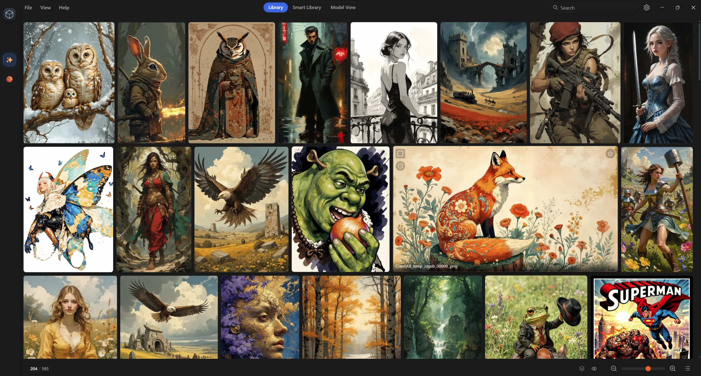
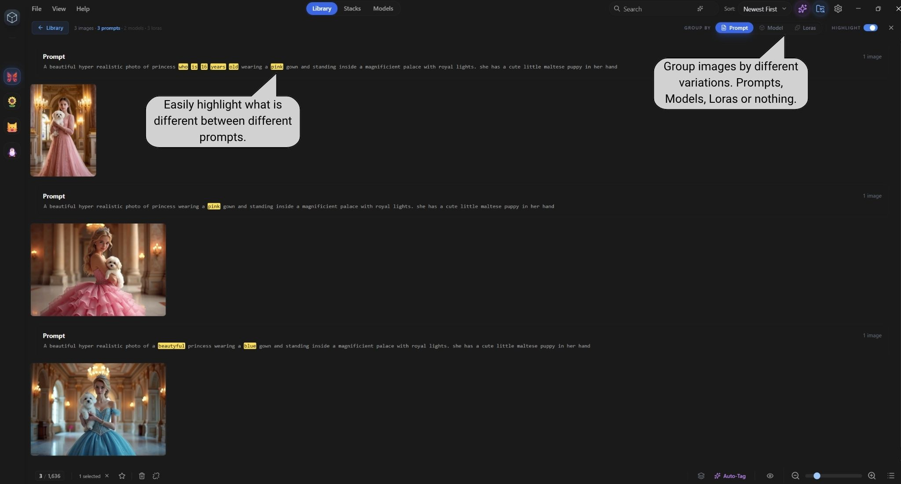
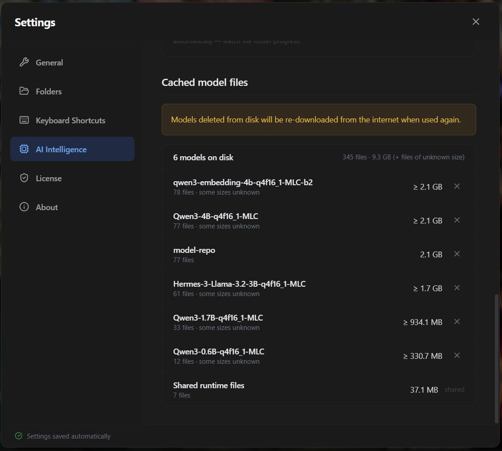
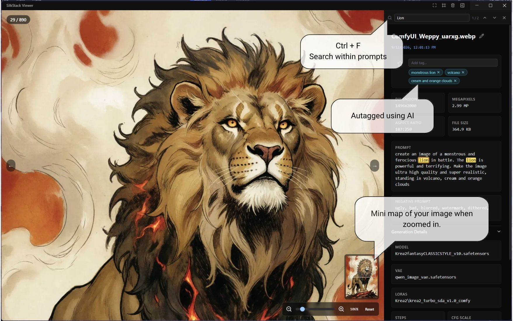
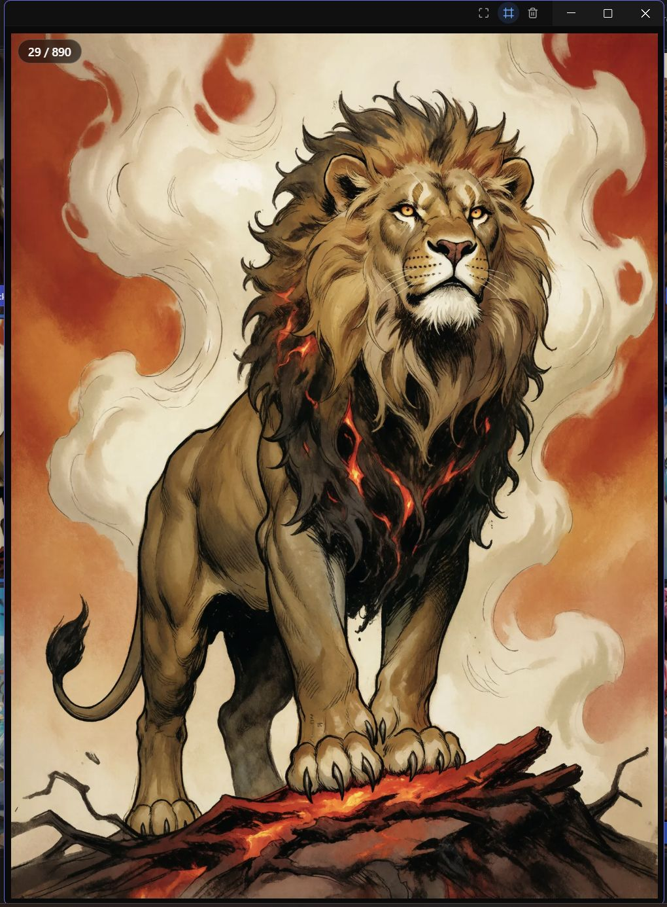

# SilkStack Image Browser

> _A beautiful image browser built specially for viewing and organizing ComfyUI generated images._

**SilkStack Image Browser** is a **local image browser and manager** focused on viewing AI-generated images.
It scans your folders, parses metadata from popular tools (ComfyUI, Automatic1111) and lets you search, filter and organize your images by prompt, model, and more - all offline, on your machine.



> This repo is a fork of **"Image MetaHub v0.13.0"**.

---

## Key features (overview)

- **Fast local browser** for AI images (no accounts, no cloud, no telemetry)
- **Rich metadata parsing** for ComfyUI and other tools, including WebP format.
- **Beautiful Image Grid** with adaptive layout and smooth scrolling.
- **Auto-Watch functionality** for real-time monitoring of output folders during generation.
- **Powerful search & filters** by prompt text, model, steps, CFG, sampler, seed, etc.
- **Smart Library** with clustering stacks and collections
- **Auto-tags and manual tags** for faster organization and discovery (see [Auto-Tagging Documentation](docs/AUTO-TAGGING.md))
- **Full image viewer** with zoom, a minimap, in-prompt search and a compact window mode
- **Drag & Drop to ComfyUI** - Drag and drop images to ComfyUI to automatically load the prompt and workflow.
- **AI features (premium)** - [semantic search](#semantic-search---search-by-meaning), [AI auto-tagging](#ai-auto-tagging) and [similarity stacks](#similarity-stacks--prompt-variation-highlighting), all running **fully locally** on your own GPU.

## What's new in SilkStack

I have added a lot of new features to this project, notably:

- **An adaptive Image Grid** that automatically adjusts images based on the aspect ratio of the images and reduces white spaces.
- **Collapsible UI** that focuses on providing the best user experience for viewing images.
- **New Window layout** that is more compact and easier to navigate.
- **Compact window mode** - The image viewer can collapse into a slim window that shows just the image, so you can keep working in another app while keeping an eye on your latest generations.
- **Minimap & in-prompt search** - Zoom into a large image and a minimap appears for quick navigation; press `Ctrl+F` to search inside the prompt of the image you are viewing.
- **Prompt variation highlighting** - In similarity stacks, SilkStack shows you exactly which words differ between the prompts behind each image.
- **Easier Themes** - Removed the need to apply themes manually. The app will now automatically apply the system theme (Light/Dark).
- **Navigation improvements** - Added folders to the sidebar for easier navigation. You can also add emoji icons to folders 😉.
- **Support for Removable Drives** - You can add folders from removable drives (USB drives, SD cards, mount encrypted drives etc.) to the sidebar and the app will automatically restore the folders when the drive is reconnected.
- **& A lot of usability improvements** - Just try it out 😉.

---

## Premium AI features

Everything under **AI Intelligence** runs on your own machine via WebGPU - no cloud service, no account, no API keys, and your images, prompts and tags are never uploaded anywhere.

The AI features are the premium part of SilkStack. They are unlocked with a license key in **Settings → License** (see [License, privacy & offline use](#license-privacy--offline-use)).


### Semantic search - search by meaning

Keyword search matches words. Semantic search matches *meaning*, so you can describe what you remember about an image and still find it:

- Describe it loosely ("girl with a puppy in a palace") and SilkStack finds images whose prompts mean the same thing, even when they use completely different words.
- Works across languages - a query in Japanese or Chinese can match English prompts.
- Semantic results are **merged with your keyword results**: semantic hits come first, keyword-only matches are appended and duplicates removed. Semantic hits are marked with a ✨ badge in the grid and table views.
- While semantic hits are on screen, the sort box offers **Relevance**; clear the search and your normal sort comes back.
- Pick your local embedding model in Settings → AI Intelligence: **Qwen3-Embedding 0.6B / 4B / 8B**, or the lighter **Arctic Embed M / S** if you are short on VRAM.
- Every image is embedded once and cached in a local database, so re-running is instant and indexing resumes where it left off after a restart.

### AI auto-tagging

- A small local LLM reads the prompt embedded in each image and writes up to **15 tags** - subjects, styles, lighting, concepts ("red fox", "snowy forest", "neon lights"). 
- Auto-tags are searchable, and they sit alongside your manual tags. Any tag the model got wrong can simply be deleted.
- **Generate Tags** only visits images it has not seen yet, and saves each image the moment it finishes - so a cancelled or interrupted run resumes instead of starting over. **Clear Auto-Tags** resets everything for a fresh re-run.

### Similarity stacks & prompt variation highlighting

Near-identical generations are grouped into **stacks**, so a folder full of 40 variations of the same idea becomes a few tidy cards.

**Vector similarity** is what makes the grouping smart. Instead of comparing prompt wording alone, SilkStack embeds each prompt with the same local model that powers semantic search and groups images whose prompts *mean* the same thing - so reworded, translated and synonym-only variations land in the same stack. It only ever adds groupings on top of plain text matching, so stacks still work with AI features off.



- The **Stack (N)** badge on a card tells you how many similar images are hiding behind it; click the blue button to open them all in the similarity stack view.
- Group the results **by Prompt, Model or Loras**, or turn grouping off entirely.
- **Highlight** (with Prompt grouping selected) marks the exact words that differ between the prompts in the stack - ideal for spotting what actually changed between two generations (a colour, an age, an added word).

### Managing AI models (and your VRAM)



- Models are downloaded once from Hugging Face and cached on disk (around 2 GB for the default embedding model, up to ~4 GB for the 8B one). After that, everything runs offline.
- The **footer pill** shows which models are currently loaded in GPU memory and how much VRAM they need, with an **Eject** button. Eject when you are done with AI features to hand the memory back to your GPU - the next AI action loads the models again automatically.
- **Settings → AI Intelligence** lists every cached model with its size, and lets you delete individual models to reclaim disk space. Deleted models are re-downloaded the next time they are needed.
- On a laptop with two GPUs, set the GPU in **Settings → AI Intelligence** to *High performance* so the models run on the discrete GPU instead of the integrated one.

### License, privacy & offline use

- The AI section is gated behind a premium license. Once activated, the license state is cryptographically stamped and verified locally.
- Activation contacts the license server once. After that SilkStack keeps working offline (the license shows as trusted while offline).
- Your images, prompts, tags and search queries never leave your machine - all AI processing happens locally. Network access is limited to downloading model files on first use.

---

## The viewing experience



- **Zoom & minimap** - zoom into the details and a minimap appears in the corner showing which part of the image you are looking at; drag it to move around. The footer keeps your zoom percentage with a one-click reset.
- **`Ctrl+F` in the viewer** - search inside the prompt of the image on screen, however long it is. Matches are highlighted with a match counter; `Enter` and `Shift+Enter` step through them, `Esc` closes the search.
- **Compact window mode** - collapse the viewer into a slim window that shows nothing but the image, so it can sit beside your generation tool while you work.




## Development

This repo contains the full source code for the core app.

- **Tech stack:** Electron, React, TypeScript, Vite
- **License:** MPL 2.0

> **Note:** the `ai-intelligence` module (semantic search, auto-tagging, vector similarity) is *not* part of this repository. When it is absent at build time the entire AI surface is compiled out and the app builds and runs as a plain local image browser - which is exactly what the open-source build does.

Basic dev commands:

```bash
# install dependencies
npm install

# run in dev mode
npm run dev:app

# build production bundle
npm run build

# build desktop app (no publish)
npm run electron-dist
```

If you're interested in contributing (bugfixes, parser support, UX tweaks, etc.), feel free to open an issue or PR.

---

## Credits

SilkStack Image Browser is built by **Saravana (skkut)** using AI and Vibe Coding, feedback from the community is welcome.

Special thanks to the original project [Image MetaHub](https://github.com/LuqP2/Image-MetaHub) for the base code.
